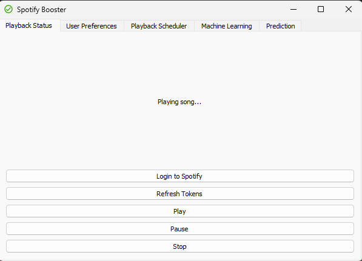
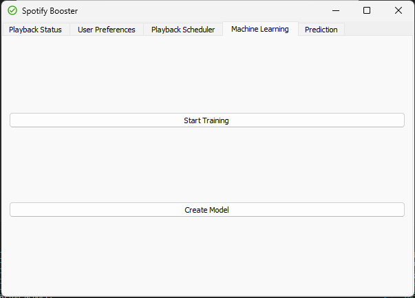
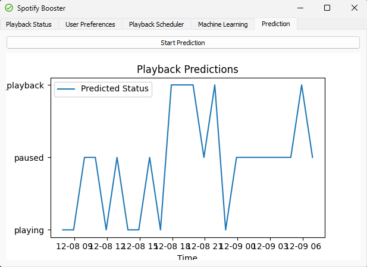
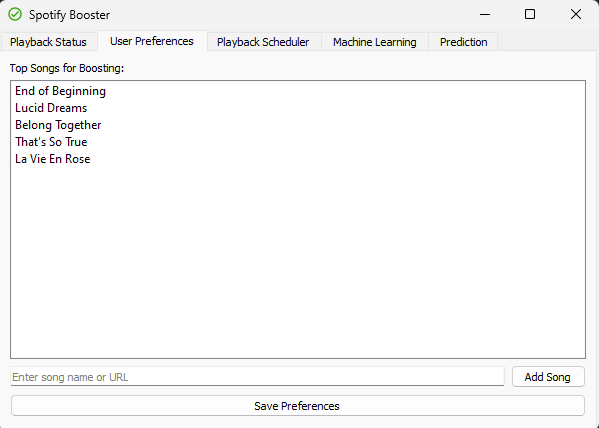
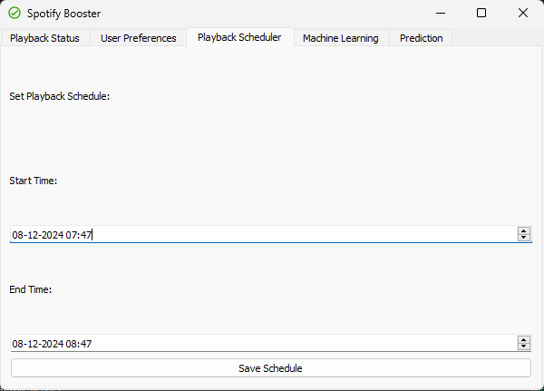

# Spotify Wrapped Bot

Spotify Wrapped Bot is a tool designed to help users optimize their Spotify Wrapped playlist. The app ensures that the songs you want to feature are played continuously during inactive periods, helping you meet the necessary hours and song requirements.

---

## Features

- **Spotify Authentication**: Securely log in with Spotify to manage playback.
- **Background Playback**: Runs seamlessly in the background, auto-starting with your computer.
- **Custom Scheduling**: Play specific songs during inactive periods to boost your stats.
- **Machine Learning**: Optional feature to learn your Spotify usage patterns and optimize playback.
- **Minimal GUI**: Simple interface for setting preferences and tracking progress.
- **Data Storage**: Saves user preferences and tokens locally or in a database.

---

## Installation

For a detailed step-by-step installation guide, see [Installation Guide](Installation.md).

---

## Screenshots

### Playback Status

### Machine Learning

### Prediction

### List of Songs

### Scheduler

---

## Usage

1. Log in with your Spotify account through the app.
2. Configure playback settings and enable "Learn My Usage" for machine learning predictions.
3. Minimize the app to the system tray, where it will continue playback in the background.

---

## Development

### Backend

- Located in `backend/`.
- Handles Spotify OAuth2 and token management.

### Frontend

- Located in `app/`.
- Provides the user interface and playback scheduler.

### Machine Learning

- Training script available in `app/machinelearning`.

---

## Roadmap

1. Add support for cross-platform compatibility (Mac, Linux).
2. Expand ML capabilities for better predictions.
3. Introduce advanced analytics for playback statistics.

---

## Contributing

Feel free to fork the repository and submit pull requests. Contributions are welcome!

---

## License

This project is licensed under the MIT License. See `LICENSE` for details.
